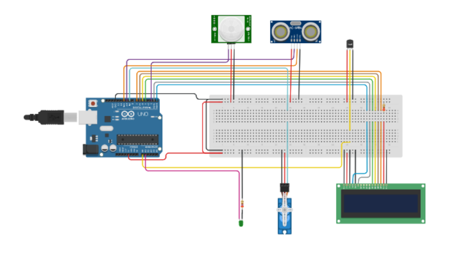

# Project: Smart Room Automation

[Link to the project on Tinkercad](https://www.tinkercad.com/things/ib4Cs7Rp04m-copy-of-final-final-final)

## Project Description

This project implements a **smart room automation system**, using an Arduino Uno module and various sensors. The goal of the project is to create an automated environment that monitors and responds to different environmental factors and interactions.

### Implemented Features:
1. **Ultrasonic Sensor**:
   - Controls the opening of an automatic door.
   - If the distance to the sensor drops below 50 cm, a servo motor opens the door to a 90° angle.
2. **PIR (Presence) Sensor**:
   - Detects motion within the room.
   - Turns on a light when motion is detected.
3. **Temperature Sensor (TMP36)**:
   - Monitors the temperature every 30 seconds.
   - If the temperature drops below 25°C, the door automatically closes (if open).
4. **LCD Display**:
   - Displays information about sensor status and real-time temperature.

### Technical Requirements:
- The code is written **at the register level**, without using Arduino functions or external libraries.
- It includes sensor control and data display on an LCD screen.

## Initial Requirements

1. **Ultrasonic Sensor**: Door opening control.
2. **PIR Sensor**: Light turn-on with motion detection.
3. **TMP36 Sensor**: Temperature monitoring.
4. **Servo Motor**: Door control.
5. **LCD Display**: Sensor data display.

## Instructions to Run

1. Clone this repository to your computer.
2. Open the `.ino` file in Arduino IDE.
3. Ensure that you have connected the components according to the schematic in the Tinkercad project.
4. Upload the code to an Arduino Uno.
5. Monitor and test the features using the LCD display and connected components.

## Project Screenshot

This project was created as part of academic requirements for a smart automation system. All components and code meet the specified requirements.
