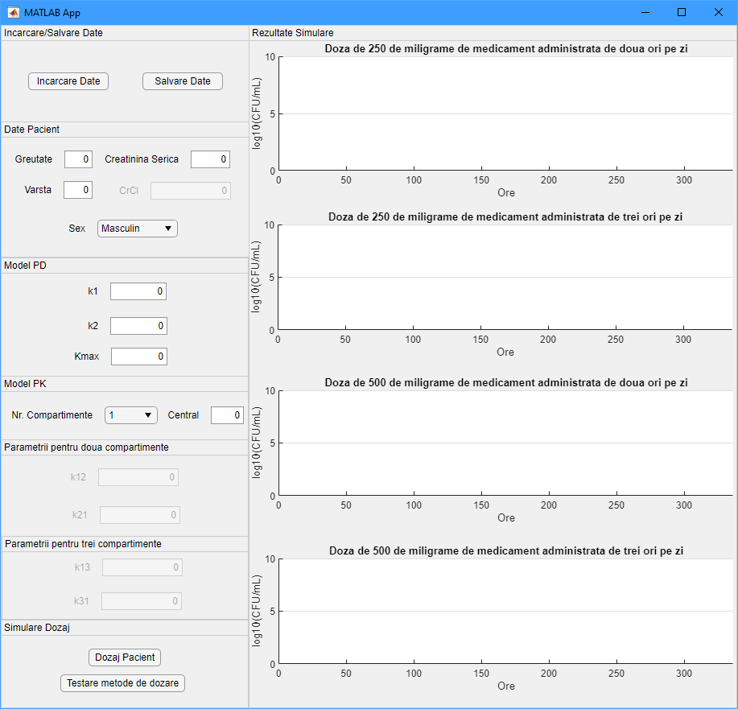
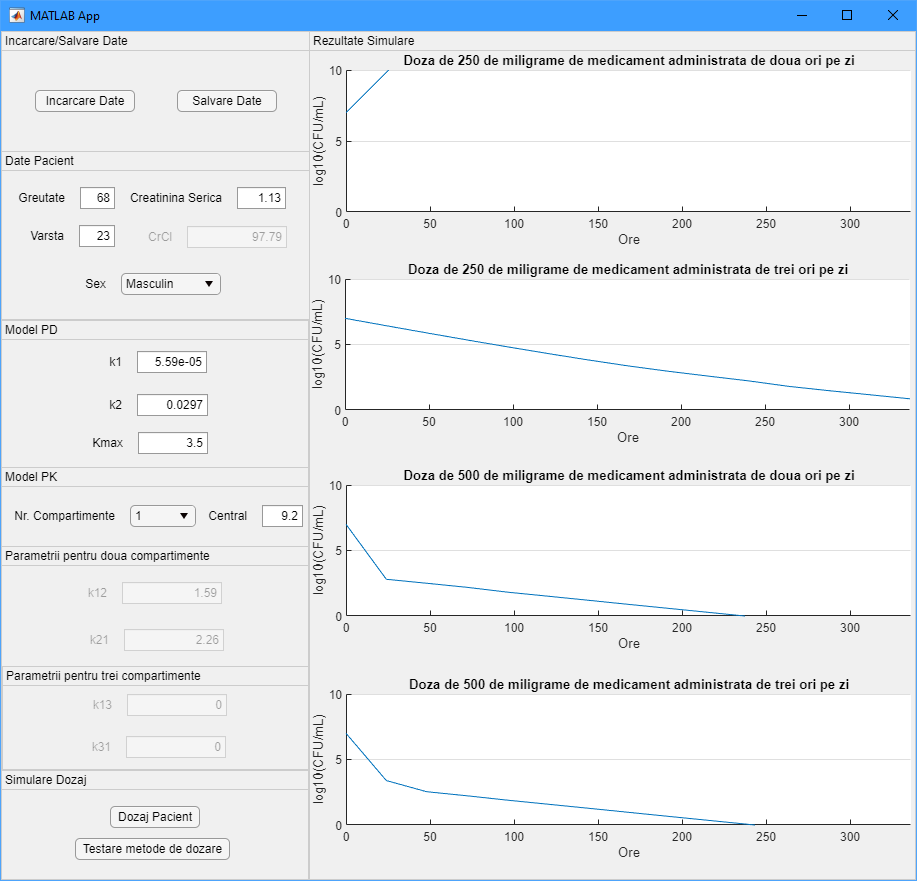
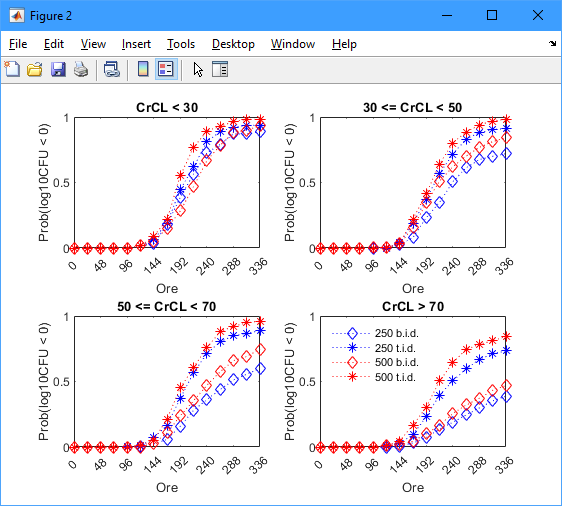

# Modeling and Simulation of Drug Dosing Strategy

## Description

This project focuses on the **modeling and simulation of drug dosing strategies**, with a special emphasis on antibiotics. Using PK/PD (Pharmacokinetics/Pharmacodynamics) models, the work establishes the optimal therapeutic dose of a drug administered to a patient.

### Main Features:
1. **PK/PD Models**:
   - One-compartment model.
   - Two-compartment model.
   - Three-compartment model.
2. **Patient Parameter Customization**:
   - Physiological parameters: sex, weight, age.
   - Biological parameters: serum creatinine, renal elimination rate.
3. **Dynamic Simulation**:
   - Simulates the evolution of the drug concentration and its effect on CFU (colony-forming units) over a 14-day period.
   - Selects the optimal dose for drug administration.
4. **Graphical User Interface (GUI)**:
   - Developed using **AppDesigner** in Matlab.
   - Allows input and adjustment of model parameters and visualization of simulation results in an accessible way.

---

## Objective

The project aims to facilitate the **optimal and safe administration of antibiotics** for patients, considering their biological and physiological parameters. The user can select the type of PK/PD model and view simulation results for multiple patients.

---

## Tools Used

- **SimBiology** in Matlab for creating and running PK/PD models.
- **AppDesigner** in Matlab for developing a user-friendly graphical interface.

---

## How Does It Work?

1. **Input Parameters**:
   - The user enters patient data (physiological and biological) in the graphical interface.
2. **Select PK/PD Model**:
   - Choose the desired pharmacokinetic model.
3. **Run Simulations**:
   - The system simulates dose dynamics over a 14-day period.
4. **Analyze Results**:
   - The user views graphs and recommendations for the optimal dose.

---

## Screenshots

### Graphical Interface

### Simulation Example 1

### Simulation Example 2

---

## Additional Documentation

For a detailed description of the project, refer to the PDF/PPTX file available in the repository:  
[License Thesis Presentation - Patrania Bogdan Andrei](./Prezentare_Licenta_PatraniaBogdanAndrei.pdf)

---

## How to Run the Project?

1. Clone the repository to your computer.
2. Open the main file in Matlab.
3. Run the application to open the graphical interface.
4. Enter patient parameters and select the PK/PD model.
5. Analyze the generated simulation results.

---

## License

This project was created as part of a Bachelor's thesis and is intended for educational use.
